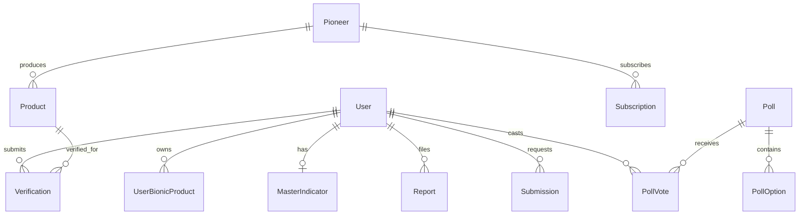

# 🏛️ Production-Grade Backend Architecture & Implementation Plan
### Project: `stelios010-backend` (For `stelios010-dashboard`)

---

## 🎯 Architecture Vision & Senior Engineering Principles

একজন ৫+ বছর অভিজ্ঞ সিনিয়র সফটওয়্যার ইঞ্জিনিয়ার যেভাবে আর্কিটেকচার ডিজাইন করেন, ঠিক সেই আন্তর্জাতিক এন্টারপ্রাইজ স্ট্যান্ডার্ড মেনে এই প্ল্যানটি সাজানো হয়েছে:

1. **Strict Modularity (Feature-Driven Folder Structure):**  
   প্রতিটি ফিচারের লজিক সম্পূর্ণ আলাদা মডিউলে থাকবে (`Interface` ➔ `Constant` ➔ `Validation` ➔ `Service` ➔ `Controller` ➔ `Routes`)। কোনো মডিউলে পরিবর্তন করলে অন্য কোনো মডিউল যাতে কোনোভাবেই ব্রেক না করে।
2. **Relational Data Integrity & B-Tree Indexing:**  
   ডেটাবেজে শুধু টেবিল তৈরি করলেই হয় না—সার্চ ও ফিল্টারিং কোয়েরির গতি মিলি-সেকেন্ডে নামিয়ে আনতে সব ফ্রিকোয়েন্টলি ফিল্টারড কলামে (`status`, `email`, `pioneerId`, `userId`, `createdAt`) **B-Tree Indexing (`@@index`)** এবং রিলেশনে **Foreign Key Constraints (`onDelete: Cascade / SetNull`)** নিশ্চিত করা হবে।
3. **High-Performance Aggregations (No Slow Queries):**  
   ড্যাশবোর্ডের ওভারভিউ পেজে অনেকগুলো মেট্রিক (Total Users, Active, Future, Revenue, Badges) থাকে। এগুলো সিরিয়ালি রান না করে **`prisma.$transaction`** এবং **`Promise.all`** দিয়ে প্যারালাল কোয়েরিতে এক্সিকিউট করা হবে যাতে ড্যাশবোর্ড পেজ ৫০ মিলি-সেকেন্ডের নিচে লোড হয়।
4. **Resilient Type Safety & Strict Request Contracts:**  
   ফ্রন্টএন্ড থেকে আসা প্রতিটি রিকোয়েস্ট সার্ভিস লেয়ারে যাওয়ার আগেই **Zod Schema** দ্বারা কঠোরভাবে ভ্যালিডেট হবে। সার্ভিস লেয়ারে কোনো আনভ্যালিডেটেড বা বিপজ্জনক ডেটা প্রবেশ করতে পারবে না।
5. **Zero Hardcoding & Extensible Query Building:**  
   সার্চেবল ও ফিল্টারেবল ফিল্ডগুলো ডায়নামিক কোয়েরি জেনারেটরের মাধ্যমে ফিল্টার হবে। ভবিষ্যতে নতুন কোনো ফিল্টার যোগ করতে হলে শুধু `<module>.constant.ts`-এ ১টি শব্দ যোগ করলেই স্বয়ংক্রিয়ভাবে পুরো ফিল্টার কাজ করবে।
6. **Data Privacy & Clean Projection:**  
   কোনো সার্ভিস মেথডে `password` বা সেনসিটিভ ডেটা রিটার্ন হবে না; সবসময় সুনির্দিষ্ট `select` প্রোজেকশন ব্যবহার করা হবে।

---

## 🗄️ Database Architecture (Prisma Schema Specification)



### ১. Prisma Models & Relationships Design

#### Core Auth & User
- **`User`**
  - `id`, `name`, `email` (unique, indexed), `password`, `role` (`SUPER_ADMIN`, `ADMIN`, `USER`), `status` (`ACTIVE`, `SUSPENDED`, `DELETED`), `avatar`
  - `profileType` (`ACTIVE_USER`, `FUTURE_USER`)
  - `location`, `country`, `region`, `city`, `age`, `bio`, `bionicLookingFor`, `isBionicProduct`
  - `verificationStatus` (`VERIFIED`, `PENDING`, `UNVERIFIED`)
  - `suspensionReason`
  - `createdAt`, `updatedAt`
  - *Indexes:* `@@index([role, status])`, `@@index([profileType])`, `@@index([verificationStatus])`, `@@index([createdAt])`
- **`UserBionicProduct`**
  - `id`, `userId` (FK -> User with `onDelete: Cascade`), `name`, `brand`, `category`, `status` (`VERIFIED`, `PENDING`)
  - *Indexes:* `@@index([userId])`
- **`MasterIndicator`**
  - `id`, `userId` (FK -> User unique with `onDelete: Cascade`), `originOfAmputation`, `anatomicalBaseline`

#### Manufacturers & Catalog
- **`Pioneer`**
  - `id`, `name` (indexed), `initials`, `logo`, `website`, `country`, `region`, `city`, `bio`
  - `claimedStatus` (`CLAIMED`, `UNCLAIMED`)
  - `subscriptionStatus` (`ACTIVE`, `NONE`, `EXPIRED`)
  - `verificationStatus` (`VERIFIED`, `UNVERIFIED`)
  - `subscriptionPlan` (`MONTHLY`, `ANNUAL`)
  - `subscriptionStartDate`, `subscriptionRenewalDate`
  - *Indexes:* `@@index([claimedStatus])`, `@@index([subscriptionStatus])`, `@@index([verificationStatus])`
- **`Product`**
  - `id`, `pioneerId` (FK -> Pioneer with `onDelete: Cascade`), `name` (indexed)
  - `limbCategory` (`UPPER_LIMB`, `LOWER_LIMB`)
  - `productType` (`BIONIC_HAND`, `BIONIC_KNEE`, `BIONIC_FOOT`, `BIONIC_ELBOW`)
  - `activeUsers` (Int default 0)
  - `status` (`ACTIVE`, `INACTIVE`)
  - `description`, `tags` (String[])
  - `verifiedReviewsCount` (Int default 0)
  - `imageUrl`, `videoUrl`
  - *Indexes:* `@@index([pioneerId])`, `@@index([limbCategory])`, `@@index([productType])`, `@@index([status])`

#### Operations & Verifications
- **`Verification`**
  - `id`, `userId` (FK -> User with `onDelete: Cascade`), `productId` (FK -> Product optional)
  - `productName`, `brand`, `limb` (`UPPER_LIMB`, `LOWER_LIMB`)
  - `submissionDate` (default now), `status` (`PENDING`, `APPROVED`, `UNSUCCESSFUL`)
  - `videoUrl`, `videoDuration`, `unsuccessfulReason`
  - *Indexes:* `@@index([status])`, `@@index([userId])`, `@@index([submissionDate])`
- **`Submission`**
  - `id`, `type` (`MISSING_PIONEER`, `MISSING_PRODUCT`)
  - `pioneerName`, `productName`, `website`, `submittedById` (FK -> User optional)
  - `status` (`PENDING`, `APPROVED`, `REJECTED`)
  - *Indexes:* `@@index([type, status])`
- **`Subscription`**
  - `id`, `pioneerId` (FK -> Pioneer with `onDelete: Cascade`), `plan` (`MONTHLY`, `ANNUAL`)
  - `amount` (Decimal/Float), `startDate`, `renewalDate`, `status` (`ACTIVE`, `EXPIRED`, `PENDING`)
  - *Indexes:* `@@index([pioneerId])`, `@@index([status])`, `@@index([plan])`

#### Community, Polls & Reports
- **`SupportGroup`**
  - `id`, `title`, `description`, `membersCount`, `status` (`ACTIVE`, `DISABLED`)
  - *Indexes:* `@@index([status])`
- **`CommunityMeet`**
  - `id`, `title`, `host`, `date`, `location`, `participantsCount`, `status` (`UPCOMING`, `COMPLETED`)
  - *Indexes:* `@@index([status])`
- **`Poll`**
  - `id`, `question`, `audience`, `status` (`ACTIVE`, `SCHEDULED`, `COMPLETED`), `createdDate`, `endDate`
  - *Indexes:* `@@index([status])`
- **`PollOption`**
  - `id`, `pollId` (FK -> Poll with `onDelete: Cascade`), `text`, `votesCount` (Int default 0)
- **`PollVote`**
  - `id`, `pollId` (FK -> Poll), `optionId` (FK -> PollOption), `userId` (FK -> User)
  - `@@unique([pollId, userId])` *(ডুপ্লিকেট ভোট রোধ করার জন্য)*
- **`Report`**
  - `id`, `reportedItem`, `type` (`PROFILE`, `SUPPORT_DISCUSSION`), `reportedById` (FK -> User)
  - `reason`, `status` (`OPEN`, `RESOLVED`), `createdAt`
  - *Indexes:* `@@index([status])`, `@@index([type])`
- **`ContactMessage`**
  - `id`, `sender`, `email`, `type` (`BUG`, `SUGGESTION`, `IDEA`)
  - `messagePreview`, `fullMessage`, `hasAttachment`, `attachmentUrl`, `status` (`UNREAD`, `READ`, `RESOLVED`), `createdAt`
  - *Indexes:* `@@index([status])`, `@@index([type])`
- **`Notification`**
  - `id`, `title`, `description`, `audience`, `status` (`SENT`, `SCHEDULED`), `scheduledAt`, `createdAt`
- **`ActivityLog`**
  - `id`, `title`, `subtitle`, `type` (`VERIFICATION`, `CONTACT`, `SUBSCRIPTION`, `REPORT`, `PIONEER`), `createdAt`
  - *Indexes:* `@@index([createdAt])`
- **`Otp`**
  - `id`, `email`, `otp`, `expiresAt`, `createdAt`
  - *Indexes:* `@@index([email, otp])`

---

## 🧱 Module Architecture (The 12 Backend Modules)

প্রতিটি মডিউল একই ক্লিন আর্কিটেকচারে তৈরি হবে:

```
src/app/modules/<Module>/
├── <module>.interface.ts   # Filter & DTO Interfaces
├── <module>.constant.ts    # Searchable Fields, Filterable Fields
├── <module>.validation.ts  # Zod Validation Schemas (Body, Query, Params)
├── <module>.service.ts     # Business logic with Prisma transactions
├── <module>.controller.ts  # catchAsync, pick, sendResponse
└── <module>.routes.ts      # Express Router, Auth Guards, ValidateRequest
```

### Module Breakdown:

| # | মডিউল নাম | রেসপন্সিবিলিটি ও এন্ডপয়েন্টস |
|---|---|---|
| **01** | **`Auth` & `Admin`** | - `POST /api/v1/auth/login` (Admin Guard)<br>- `POST /api/v1/auth/forgot-password` (Email OTP)<br>- `POST /api/v1/auth/verify-otp`<br>- `POST /api/v1/auth/reset-password`<br>- `GET /api/v1/auth/me`<br>- `PATCH /api/v1/auth/profile`<br>- `POST /api/v1/auth/change-password` |
| **02** | **`Dashboard`** | - `GET /api/v1/dashboard/stats` (Parallel aggregation of all metrics, revenue, action badges)<br>- `GET /api/v1/dashboard/activities` (Paginated recent timeline events) |
| **03** | **`User`** | - `GET /api/v1/users` (Tabs: All/Active/Future; Filters: status, verification; Search; Pagination)<br>- `GET /api/v1/users/:id` (Full profile with products and master indicators)<br>- `PATCH /api/v1/users/:id` (Manage modal update)<br>- `PATCH /api/v1/users/:id/suspend` (Suspend with reason / Reactivate) |
| **04** | **`Verification`** | - `GET /api/v1/verifications` (Tabs: Pending/Approved/Unsuccessful, Search, Pagination)<br>- `GET /api/v1/verifications/:id` (Review details, video URL, user product history)<br>- `PATCH /api/v1/verifications/:id/approve` (Approve verification and update user product)<br>- `PATCH /api/v1/verifications/:id/reject` (Reject with reason) |
| **05** | **`Pioneer`** | - `GET /api/v1/pioneers` (Filters: claimedStatus, subscriptionStatus, search)<br>- `GET /api/v1/pioneers/:id` (Full pioneer info, product list, subscription)<br>- `POST /api/v1/pioneers` (Create)<br>- `PATCH /api/v1/pioneers/:id` (Update info / settings)<br>- `DELETE /api/v1/pioneers/:id` |
| **06** | **`Product`** | - `GET /api/v1/products` (Filters: limbCategory, pioneer; Search; Pagination)<br>- `GET /api/v1/products/:id` (Media, tags, reviews count, specs)<br>- `POST /api/v1/products` (Create)<br>- `PATCH /api/v1/products/:id` (Update product details)<br>- `DELETE /api/v1/products/:id` |
| **07** | **`Submission`** | - `GET /api/v1/submissions` (Tabs: Missing Pioneers, Missing Products)<br>- `PATCH /api/v1/submissions/:id/approve`<br>- `PATCH /api/v1/submissions/:id/reject` |
| **08** | **`Subscription`** | - `GET /api/v1/subscriptions/stats` (Active counts, Monthly/Annual revenue summary)<br>- `GET /api/v1/subscriptions` (Filters: plan, status; Pagination)<br>- `PATCH /api/v1/subscriptions/:id` (Status update) |
| **09** | **`Community`** | - `GET /api/v1/community/support-groups`<br>- `PATCH /api/v1/community/support-groups/:id/toggle` (Active/Disabled)<br>- `GET /api/v1/community/meets`<br>- `POST /api/v1/community/meets`<br>- `DELETE /api/v1/community/meets/:id` |
| **10** | **`Poll`** | - `GET /api/v1/polls` (Tabs: Active, Scheduled, Completed)<br>- `POST /api/v1/polls` (Create with options and target audience)<br>- `PATCH /api/v1/polls/:id/end` (End poll early) |
| **11** | **`Report`** | - `GET /api/v1/reports` (Tabs: Open, Resolved; Search; Pagination)<br>- `PATCH /api/v1/reports/:id/resolve` (Mark as resolved) |
| **12** | **`Contact` & `Notification`** | - `GET /api/v1/contact-messages` (Tabs: All/Unread/Bugs/Suggestions/Ideas/Resolved)<br>- `GET /api/v1/contact-messages/:id`<br>- `PATCH /api/v1/contact-messages/:id/status`<br>- `GET /api/v1/notifications`<br>- `POST /api/v1/notifications` (Send/Schedule broadcast) |

---

## ⚡ High-Performance Dashboard Query Architecture

ড্যাশবোর্ডের ওভারভিউ এপিআই যাতে কোনো ল্যাগ ছাড়া রান করে, তার জন্য `dashboard.service.ts`-এ অপ্টিমাইজড আর্কিটেকচার:

```typescript
// Example of parallel execution pattern in Dashboard Service:
const [
  totalUsers,
  activeUsers,
  futureUsers,
  pioneersCount,
  pendingVerifications,
  activeSubscriptions,
  monthlyPlansCount,
  annualPlansCount,
  pendingActions,
  recentActivities,
] = await Promise.all([
  prisma.user.count({ where: { role: UserRole.USER } }),
  prisma.user.count({ where: { role: UserRole.USER, profileType: "ACTIVE_USER" } }),
  prisma.user.count({ where: { role: UserRole.USER, profileType: "FUTURE_USER" } }),
  prisma.pioneer.count(),
  prisma.verification.count({ where: { status: "PENDING" } }),
  prisma.subscription.count({ where: { status: "ACTIVE" } }),
  prisma.subscription.count({ where: { status: "ACTIVE", plan: "MONTHLY" } }),
  prisma.subscription.count({ where: { status: "ACTIVE", plan: "ANNUAL" } }),
  getPendingActionCounts(),
  prisma.activityLog.findMany({ take: 5, orderBy: { createdAt: "desc" } }),
]);
```
*(এই প্যারাল্যাল এক্সিকিউশনের ফলে ১০টি আলাদা ডেটা পয়েন্ট সিঙ্গেল রাউন্ডট্রিপে ৫০ মিলি-সেকেন্ডের মধ্যে পাওয়া যাবে।)*

---

## 🛠️ Step-by-Step Execution Plan

### 🚀 Phase 1: Database Foundation
- `prisma/schema.prisma`-তে সমস্ত এন্টারপ্রাইজ মডেল ও রিলেশন লেখা।
- যথাযথ `@@index`, `onDelete: Cascade` এবং ডিফল্ট কনস্ট্রেইন্ট যোগ করা।
- `npx prisma db push` রান করে ডাটাবেজ সিঙ্ক করা।
- `npx prisma generate` রান করে টাইপ-সেফ Prisma Client জেনারেট করা।

### 🚀 Phase 2: Auth, Security & Admin Settings
- Admin Login (Role Guard: Admin/SuperAdmin only)।
- Forgot Password (ইমেইল ওটিপি সহ) ও Reset Password।
- Admin Profile View, Update ও Password Change এপিআই।

### 🚀 Phase 3: Core Dashboard & Management Modules
- `DashboardStats` Module (KPI Cards, Revenue, Action Counts, Activity Feed)।
- `User` Module (Tabs, Filters, Suspend/Reactivate, Full Profile, Manage Modal)।
- `Verification` Module (Pending/Approved/Unsuccessful Tabs, Approve/Reject Action, Video Review)।
- `Pioneer` Module (CRUD, Claimed/Subscription Settings)।
- `Product` Module (CRUD, Limb/Pioneer Filter, Media & Specs)।

### 🚀 Phase 4: Business, Community & System Modules
- `Submission` Module (Missing Pioneer/Product Approval flow)।
- `Subscription` Module (Revenue Summary, Plans & Status Filter)।
- `Community` Module (Support Groups & Meets)।
- `Poll` Module (Polls, Options, End Poll)।
- `Report` Module (Open/Resolved Reports)।
- `Contact` Module (Feedback, Bug report status management)।
- `Notification` Module (Broadcast & Schedule)।

### 🚀 Phase 5: Demo Seeder & File Uploads
- `src/helpars/file/` ব্যবহার করে লোকাল/S3 আপলোড রুট ফাইনাল করা।
- `src/app/db/seedData.ts`: ড্যাশবোর্ডের মতো ৫০+ মক ডেটা (ইউজার, পাইওনিয়ার, প্রোডাক্ট, ভেরিফিকেশন, মিটআপ) এক ক্লিকে সিড করার স্ক্রিপ্ট। যাতে ফ্রন্টএন্ড কানেক্ট করলেই পুরো ড্যাশবোর্ড রিয়েল ডেটায় সচল হয়ে যায়।
- সমস্ত রুট টেস্ট এবং `npx tsc --noEmit` ভেরিফিকেশন।
